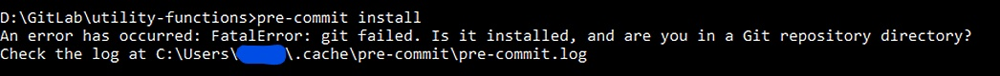
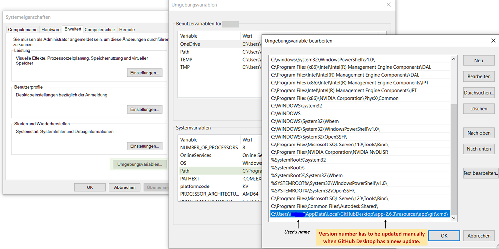
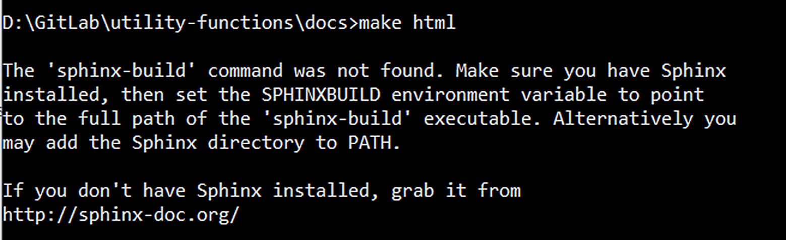
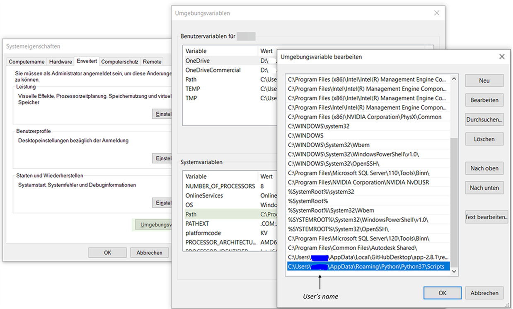

.. _faq:

Frequently Asked Questions
==============================

This is a collection of some questions that have been asked frequently.

I installed git, but the git executable cannot be found
--------------------------------------------------------------
Sometimes, after you install git it will not be automatically assigned to the environment variables.
In this case, you can add the path to git to your environment variables manually. The error might look like the following.

    Error message if git was not correctly added to the environment PATH.

On Windows this is done by navigating to "Advanced System Settings", then "Advanced" and clicking
"Environment Variables" at the bottom of the window. In the figure you can see the path for
git.exe in GitHub Desktop 2.6.3 added to the SYSTEM variables:

   Adding git to environment variables.

Alternatively, you can use a terminal to add the variable:

.. code-block:: console

    $ set PATH=%PATH%;<Your Git Path>

In case of any problems with locating of git on your device, `this StackOverflow discussion
(external link) <https://stackoverflow.com/questions/11928561/where-is-git-exe-located>`_
might help.

After this, git should work as expected.

I cannot login to gitlab, but Windows doesn't ask for new login information
--------------------------------------------------------------------------------
Git uses the Windows credential manager and sometimes does not recognize correctly when
a wrong password or username is provided. This leads to errors regarding incorrect login
information but git does not ask for corrected information.

You can force resetting the git credentials in Windows:

- open "Credential Manager" in system control
- Delete information about the git server you are trying to login to
  (in  case of eta_nexus: "git.ptw.maschinenbau.tu-darmstadt.de <git.ptw.maschinenbau.tu-darmstadt.de>"_).

.. _sphinx_not_found:

I want to execute sphinx, but it complains it's not installed
--------------------------------------------------------------

If you receive the following message, you might  have to add the sphinx-scripts to your
environment variables.

    Error message shown when trying to build the documentation.

First, find the path to your sphinx installation, then add it via the terminal or through the
"Advanced system settings" in Windows.

.. code-block:: console

    $ set PATH=%PATH%;<Your sphinx path>

    Adding sphinx scripts to PATH

.. _packages_error:

I want to start *eta_nexus*, but in some external packages there were changes
----------------------------------------------------------------------------------
If you want to use *eta_nexus*, but you get errors in some Python packages, because there were changes in the source \
code, update *eta_nexus* with the following command (add extra requirements like `eta_x` as needed):

.. code-block:: console

    $ pip install --upgrade --upgrade-strategy=only-if-needed eta_nexus
